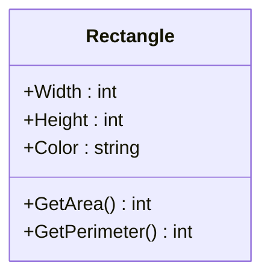
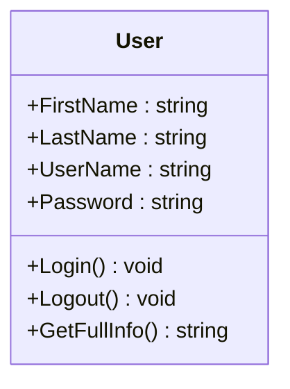
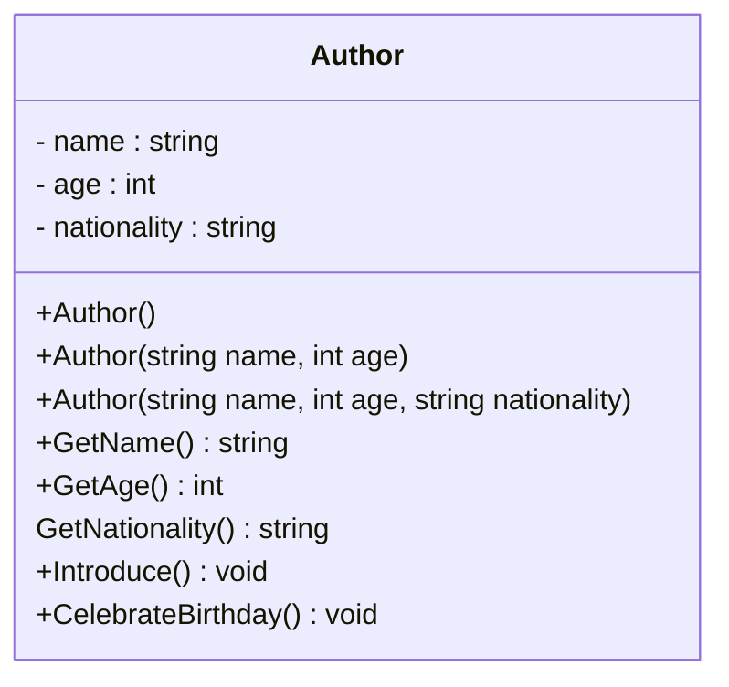
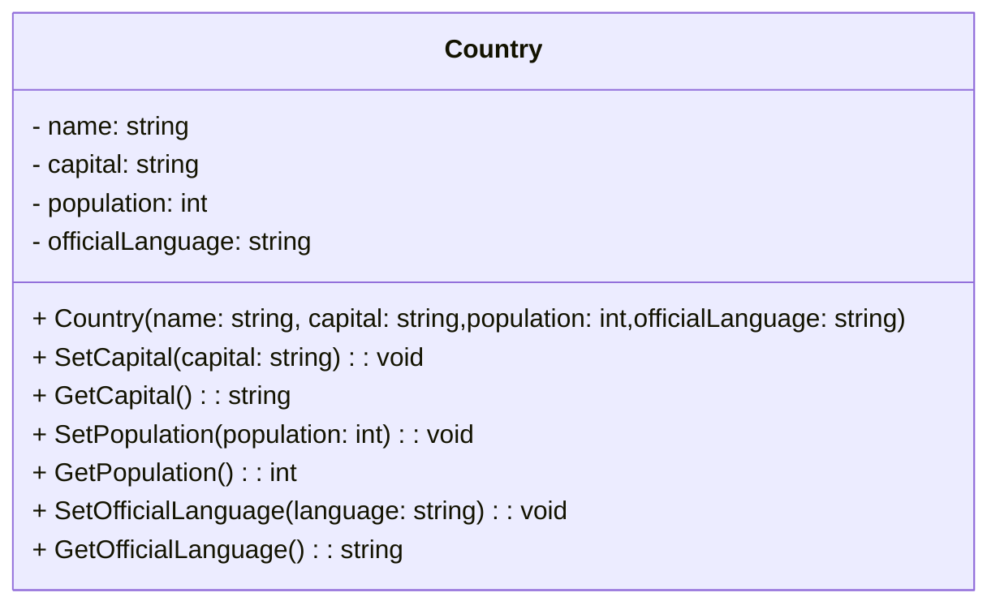

### Task 1

Create class called `Rectangle` with following characteristics:

* `Width`: An integer representing the width of the rectangle.
* `Height`: An integer representing the height of the rectangle.
* `Color`: A string representing the color of the rectangle.
* `GetArea()` : Returns the area of the rectangle.
* `GetPerimeter()` : Returns the perimeter of the rectangle.

----

Создайте класс под названием `Rectangle`со следующими характеристиками:

* `Width`: целое число, представляющее ширину прямоугольника.
* `Height`: целое число, представляющее высоту прямоугольника.
* `Color`: строка, представляющая цвет прямоугольника.
* `GetArea()`: возвращает площадь прямоугольника.
* `GetPerimeter()`: возвращает периметр прямоугольника.

----

Класе бо номи `Rectangle` ва бо хусусиятҳои зерин созед:

* `Width`:: адади бутун, ки дарозии росткунҷаро ифода мекунад.
* `Height`: адади бутун, ки баландии росткунҷаро ифода мекунад.
* `Color`: Сатр, ки ранги росткунҷаро ифода мекунад.
* `GetArea()` Масохати росткунҷаро бармегардонад.
* `GetPerimeter()`: Периметри росткунҷаро бармегардонад.


---

### Task 2
  
**Properties:**
- `FirstName` (string) - User name.
- `LastName` (string) - User's last name.
- `Username` (string) - Username (login).
- `Password` (string) - User password.
- `IsLoggedIn` (bool) - Flag indicating whether the user is logged in.

**Public Methods:**

- `void Login(string username, string password)`: If the password and username match, Print `"User logged in successfully"` and set IsLoggedIn to true. Otherwise, print `"Your password or username is incorrect" `  

- `void Logout()`: Changes `IsLoggedIn` to `false`.

- `string GetFullInfo()`: Returns the information in the format `"FirstName LastName - IsLoggedIn"`. 

    ex: `"Abdullah Abdulloev - true"`

----


**Свойства:**
- `FirstName` (string) - Имя пользователя.
- `LastName` (string) - Фамилия пользователя.
- `Username` (string) - Имя пользователя (логин).
- `Password` (string) - Пароль пользователя.
- `IsLoggedIn` (bool) - Флаг указывающий, вошел ли пользователь в систему.

**Методы:**

- `void Login(string username, string password)` - Если пароль и имя пользователя совпадают, выводится сообщение `"Пользователь успешно зарегистрирован"`, и устанавливается значение `IsLoggedIn` в `true`. В противном случае выводится сообщение `"Ваш пароль или имя пользователя неверны"`.

- `void Logout()` - Изменяет значение `IsLoggedIn` на `false`.

- `string GetFullInfo()` - Возвращает информацию о пользователе в формате `"FirstName LastName - IsLoggedIn"`. 

    пример: `"Абдулла Абдуллоев - true"`

----

Класе бо номи `User` созед.

атрибутхояш:
- `FirstName` (string)  - Номи истифодабаранда.
- `LastName` (string)- Насаби истифодабаранда.
- `Username` (string) - Номи(username)-и истифодабаранда.
- `Password` (string) - Пароли истифодабаранда.
- `IsLoggedIn` (bool) - оё истифодабаранда вориди систем шудааст.

Методхо:
- `void Login(string username, string password)`  - Агар парол ва номи истифодабаранда якхела бошанд, паёми `"User logged in successfully"` нишон дода мешавад ва арзиши `IsLoggedIn` `true` мешавад. Дар акси ҳол, паёми `"Your password or username is incorrect"` нишон дода мешавад.
- `void Logout()` - Қимати `IsLoggedIn`-ро ба `false` иваз мекунад.
- `string GetFullInfo()` - Маълумотро дар бораи истифодабаранда дар формати `"FirstName LastName - IsLoggedIn"`  бармегардонад. 

    мисол: `"Абдулло Абдуллоев — true"`



### Task3
Create a class called `Author` with multiple methods and constructors. The class should have the following characteristics:

1. Class Fields:
   - `name` (author's name) - a string,
   - `age` (author's age) - an integer,
   - `nationality` (author's nationality) - a string.

2. Class Methods:
   - `GetName()` - returns the author's name,
   - `GetAge()` - returns the author's age,
   - `GetNationality()` - returns the author's nationality,
   - `Introduce()` - prints a message in the format `"My name is {name}. I am {age} years old. I am from {nationality}."`,
   - `CelebrateBirthday()` - increments the author's age by 1.

3. Constructors:
   - Default constructor: takes no arguments and initializes the class fields with default values.
   - Constructor: takes arguments `name` and `age` and initializes the corresponding class fields.
   - Constructor: takes arguments `name`, `age`, and `nationality` and initializes the corresponding class fields.

Remember to use access modifiers for the class fields and properties to access these fields.

----

Создайте класс `Author` (Автор) с несколькими методами и несколькими конструкторами. 

Класс должен иметь следующие характеристики:

1. Поля класса:
   - `name` (имя автора) - строка,
   - `age` (возраст автора) - целое число,
   - `nationality` (национальность автора) - строка.

2. Методы класса:
   - `GetName()` - возвращает имя автора.
   - `GetAge()` - возвращает возраст автора.
   - `GetNationality()` - возвращает национальность автора.
   - `Introduce()` - выводит сообщение в формате `"Меня зовут {name}. Мне {age} лет. Я из {nationality}."`.
   - `CelebrateBirthday()` - увеличивает возраст автора на 1.

3. Конструкторы:
   - Конструктор по умолчанию, который не принимает аргументов и инициализирует поля класса значениями по умолчанию.
   - Конструктор, принимающий аргументы `name` и `age` и инициализирующий соответствующие поля класса.
   - Конструктор, принимающий аргументы `name`, `age` и `nationality` и инициализирующий соответствующие поля класса.

----

Класеро бо номи `Author` созед. Класс бояд дорои хусусиятҳои зерин бошад:

1. fields:
    - `name` (номи муаллиф) - сатр.
    - `age` (синну соли муаллиф) - адади бутун.
    - `nationality` (миллати муаллиф) - сатр.

2. Методхои Класс:
    - `GetName()` - номи муаллифро бармегардонад.
    - `GetAge()` - синну соли муаллифро бармегардонад.
    - `GetNationality()` - ватани муаллифро бармегардонад.
    - `Introduce()` - паёмро дар чунин формат чоп мекунад : `"Номи ман {name}. Ман {age} сола ҳастам. Ман аз {nationality} ҳастам."`.
    - `CelebrateBirthday()` - синну соли муаллифро 1-то зиёд мекунад.

3. Консткукторхо:
    - Конструтори холи: ягон параметр қабул намекунад ва фиелдхои классро бо арзишҳои пешаки кимат мемонад.
    - Конструктор: аргументҳои `name` ва `age`-ро мегирад ва майдонҳои класс-ро пур мекунад.
    - Конструктор: аргументҳои `name`, `age` ва `nationality`-ро мегирад ва майдонҳои класс-ро пур мекунад.

Дар хотир доред, ки барои дастрасии тағирдиҳандаҳо  проперти истифода баред.





### Task4
Create a class `Country` representing a country with the following characteristics:

- `name` - a string representing the name of the country.
- `capital` - a string representing the capital city of the country.
- `population` - an integer representing the population of the country.
- `officialLanguage` - a string representing the official language(s) of the country.

- The `Country` class should have the following methods:

- `SetCapital(string capital)`: a method to set the capital city of the country.
- `GetCapital()`: a method that returns the capital city of the country.
- `SetPopulation(int population)`: a method to set the population of the country.
- `GetPopulation()`: a method that returns the population of the country.
- `SetOfficialLanguage(string language)`: a method to set the official language(s) of the country.
- `GetOfficialLanguage()`: a method that returns the official language(s) of the country.
- The `Country` class should have a constructor that takes the name, capital, population, and official language(s) as parameters when creating an object.

----
Создайте класс `Country`, представляющий страну, с следующими характеристиками:

- `name` - строка, представляющая название страны.
- `capital` - строка, представляющая столицу страны.
- `population` - целое число, представляющее население страны.
- `officialLanguage` - строка, представляющая официальный язык(и) страны.
- Класс `Country` должен иметь следующие методы:

- `SetCapital(string capital)`: метод для установки столицы страны.
- `GetCapital()`: метод, возвращающий название столицы страны.
- `SetPopulation(int population)`: метод для установки населения страны.
- `GetPopulation()`: метод, возвращающий население страны.
- `SetOfficialLanguage(string language)`: метод для установки официального языка(ов) страны.
- `GetOfficialLanguage()`: метод, возвращающий официальный язык(и) страны.
- Класс `Country` должен иметь конструктор, который принимает название, столицу, население и официальный язык(и) страны при создании объекта.


----

Класе бо номи `Country` ва бо хусусиятҳои зерин созед:

- `name` - сатр, ки номи кишварро ифода мекунад.
- `capital` - сатр, ки пойтахти кишварро ифода мекунад.
- `population` - адади бутун, ки ањолии кишварро ифода мекунад.
- `officialLanguage` - сатри ифодакунандаи забон(ҳо)-и расмии кишвар.
- Класс `Country` бояд усулҳои зеринро дошта бошад:

- `SetCapital (string capital)`: усули муқаррар кардани пойтахти кишвар.
- `GetCapital ()`: усуле, ки пойтахти кишварро бармегардонад.
- `SetPopulation (int population)`: усули муқаррар кардани шумораи аҳолии кишвар.
- `GetPopulation ()`: усуле, ки шумораи аҳолии кишварро бармегардонад.
- `SetOfficialLanguage(string language)`: усули муқаррар кардани забон(ҳо)-и расмии кишвар.
- `GetOfficialLanguage()`: усуле, ки забон(ҳо)-и расмии кишварро бармегардонад.
- Класс `Country` бояд конструктор дошта бошад, ки ҳангоми сохтани объект name, capital, population ва officialLanguage-ро ҳамчун параметр қабул мекунад.




**Output**

```
Country Name: Tajikistan
Capital: Dushanbe
Population: 9,537,645
Official Language: Tajik

```


